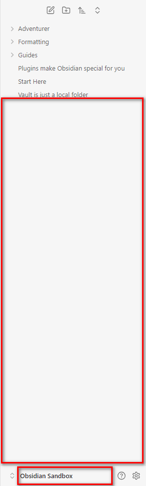
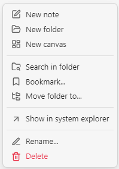

# Root Folder Context Menu

This is a plugin for [Obsidian](https://obsidian.md/) that enables context menu for vault root folder and the empty area of the `Files` pane.



Full context menu as for any other folder is added:



## Installation

- The plugin is available in [the official Community Plugins repository](https://obsidian.md/plugins?id=root-folder-context-menu).
- [Beta releases](obsidian://brat?plugin=https://github.com/mnaoumov/obsidian-root-folder-context-menu) can be installed via [BRAT](https://obsidian.md/plugins?id=obsidian42-brat).

## Debugging

By default, debug messages for this plugin are hidden.

To show them, run the following command:

```js
window.DEBUG.enable('root-folder-context-menu');
```

For more details, refer to the [documentation](https://github.com/mnaoumov/obsidian-dev-utils?tab=readme-ov-file#debugging).

## Support

<a href="https://www.buymeacoffee.com/mnaoumov" target="_blank"></a>

## License

© [Michael Naumov](https://github.com/mnaoumov/)
