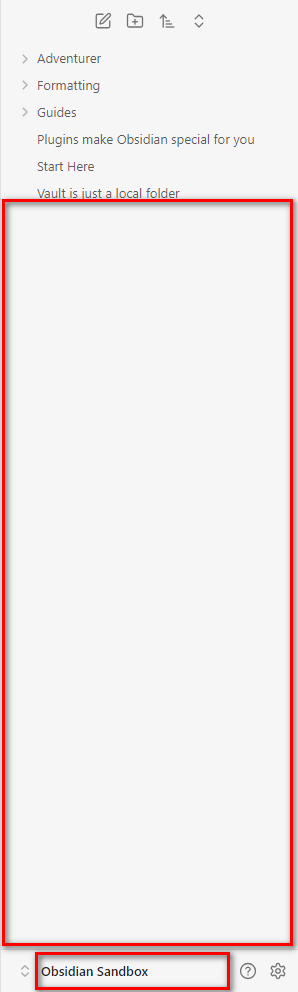
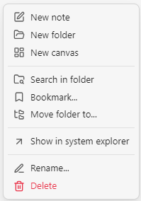

# Root Folder Context Menu

[](https://www.buymeacoffee.com/mnaoumov)
[](https://github.com/mnaoumov/obsidian-root-folder-context-menu/releases)
[](https://github.com/mnaoumov/obsidian-root-folder-context-menu/releases)

This is a plugin for [Obsidian](https://obsidian.md/) that enables context menu for vault root folder and the empty area of the `Files` pane.



Full context menu as for any other folder is added:



## Installation

The plugin is available in [the official Community Plugins repository](https://obsidian.md/plugins?id=root-folder-context-menu).

### Beta versions

To install the latest beta release of this plugin (regardless if it is available in [the official Community Plugins repository](https://obsidian.md/plugins) or not), follow these steps:

1. Ensure you have the [BRAT plugin](https://obsidian.md/plugins?id=obsidian42-brat) installed and enabled.
2. Click [Install via BRAT](https://intradeus.github.io/http-protocol-redirector?r=obsidian://brat?plugin=https://github.com/mnaoumov/obsidian-root-folder-context-menu).
3. An Obsidian pop-up window should appear. In the window, click the `Add plugin` button once and wait a few seconds for the plugin to install.

## Debugging

By default, debug messages for this plugin are hidden.

To show them, run the following command:

```js
window.DEBUG.enable('root-folder-context-menu');
```

For more details, refer to the [documentation](https://github.com/mnaoumov/obsidian-dev-utils/blob/main/docs/debugging.md).

## Support

<!-- markdownlint-disable MD033 -->

<a href="https://www.buymeacoffee.com/mnaoumov" target="_blank"></a>

<!-- markdownlint-enable MD033 -->

## My other Obsidian resources

[See my other Obsidian resources](https://github.com/mnaoumov/obsidian-resources).

## License

© [Michael Naumov](https://github.com/mnaoumov/)
